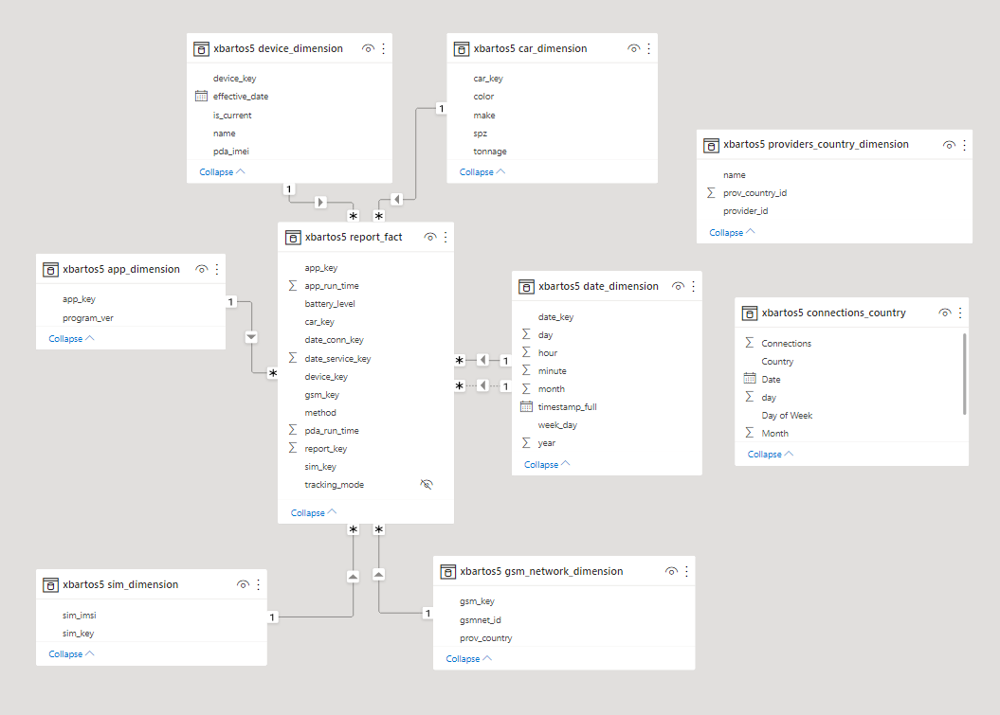
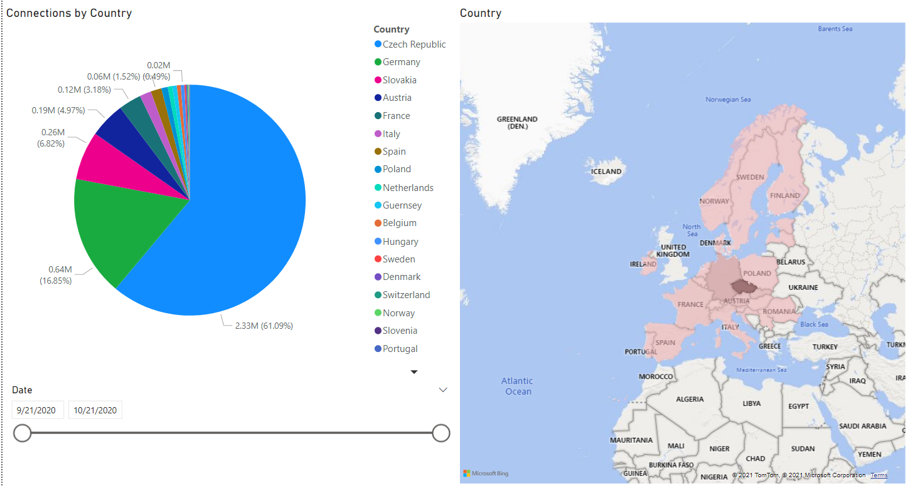
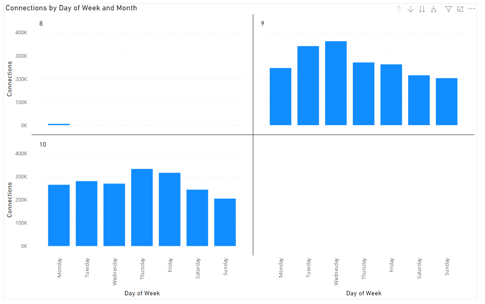
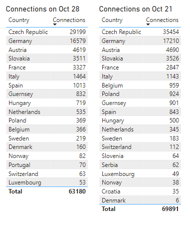

# GPS Car Tracking System - Analytics 
## _(Project for PA220 Database systems for data analytics)_

## **Application Domain**
Each car is equipped with a mobile device (Android) and an application
- The application
    - tracks movement of the car – records driving as well as stationarity;
    - allows the drivers to jot down events – refueling, loading/unloading cargo, rest time (sleeping);
    - allows the drivers and operators to communicate via messages;
    - periodically upload these data to server; and
    - periodically reports its status to server.

## **Domain of DW**
DW must support the following analyses:
- Per program version, report
    - the number of different device (physical phones),
    - the number of different phone models,
    - the number of phone/app restarts (app_run_time / phone_run_time is zero (or close to)).
- Per physical device, report the same (as per prog. ver.) plus:
    - the number of program versions.
- By analogy, report the info per phone model.
- Distribution (pie-chart) of program versions among physical devices
    - for varying time period
- Distribution of phone models among physical devices.
    - How many phone of a particular model are used.

## **Create base analytical queries**
Queries are included in the folder `/queries`.

### **Query 1**
List connection counts per app version and day during Oct 2020.
- Print also totals per day, per app and grand total.
- Sort the result by day and app both descending.
- Add a commentary about possible anomalies.

### **Query 2**
List the connections counts in individual operator networks per weekday and month.
- Print also the country name of the operator (extend the dimension)

### **Query 3**
Report on oldest and newest app version for all devices, e.g., for “HUAWEI CUN-L21” and not a particular IMSI/IMEI/car_key.

### **Query 4**
Report on the reliability of devices – number of app restarts without device restart (aka
app crashes).
- List top-10 for the combination of app version and device (if any)

### **Query 5**
Identify “connectivity” problems – an app instance connecting too often (i.e, next connection in much shorter time than 5 mins).
- List raw results (particular devices (IMEIs)), aggregate by device name (Huawei …) and by app
version.

## **Optimize the analytical queries**
Optimized queries and results of the optimization are included in the folder `/optimization`.

Optimize all the queries from the HA2
- so their evaluation is at least 2x times faster
- If you are not successful, mention it in the comment and try to explain why.

Prefer generic solutions applicable to more queries
- if a materialized view is created, it must be used in two queries at least
- also state how often the query/queries must be executed to amortize the costs to create
the view.

## **Reports in Power BI**
### **Model**
Model of the provided tables and its associations.

### **Page 1**
Chart for the number of connections per country of data transfer.

### **Page 2**
A bar chart for number of connections per day of the week, separated
for individual months.

### **Page 3**
Traffic comparison during public holiday (Oct 28 and Oct 21).

